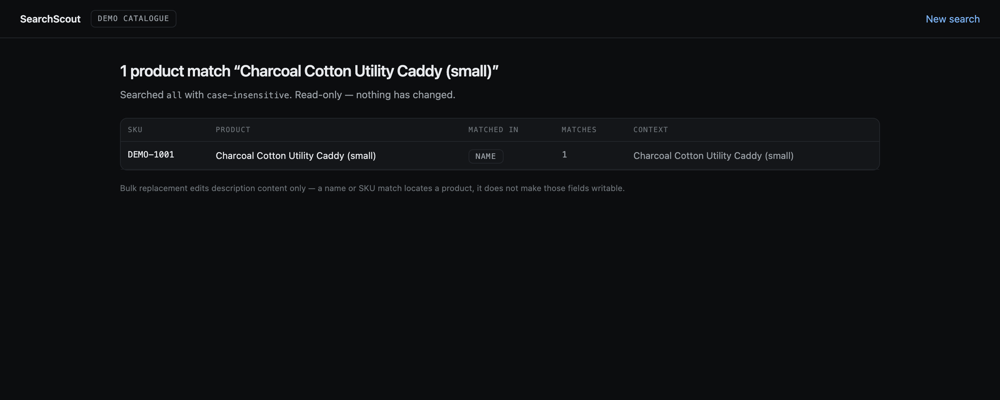
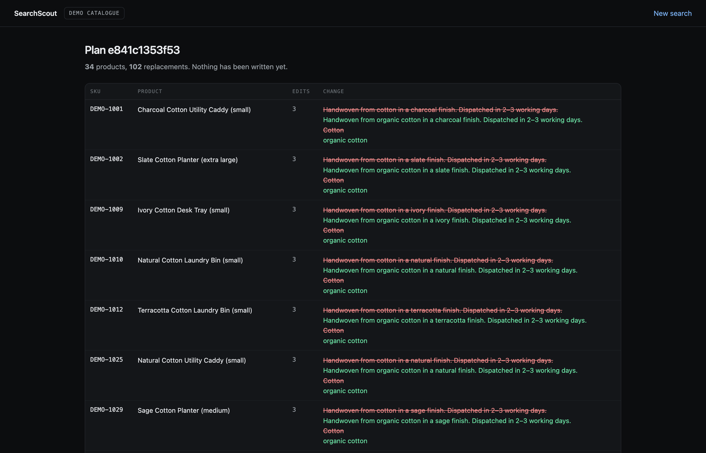
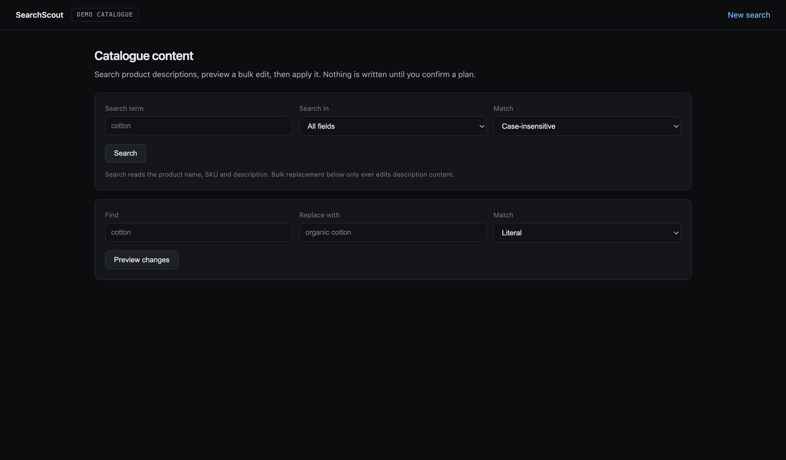

<div align="center">

# SearchScout

**Catalogue content search and safe bulk editing for e-commerce product descriptions.**

Finds a term across thousands of merchandiser-authored HTML descriptions, shows
exactly what an edit would change, and only then writes it — with an audit trail
and a one-command rollback.

[](tests/)
[](pyproject.toml)
[](#running-it)
[](LICENSE)

</div>

---

## Problem

A retail catalogue accumulates wording that later has to change everywhere at
once: a supplier is renamed, a material is reworded, a delivery promise is
updated. There were a few thousand products and the copy lived in a custom HTML
attribute in Magento, so the options were an afternoon of clicking through the
admin, or a script.

The script existed. It had two problems that mattered more than the time it saved.

**It edited raw markup.** Product copy is merchandiser HTML — tables, inline
styles, links, entities. A string replacement across that will happily rewrite a
class name, an `href` or the inside of a `<script>` and corrupt the page.

**It could not be previewed.** Search and write happened in one pass, so the
first sight of a change was after it had been made, and there was no record of
what the previous content had been.

## Solution

Three things, in order of how much they matter:

**Edits happen in text nodes only.** The document is parsed and the replacement
is applied to text, never to a tag, an attribute, a comment, or the contents of
`<script>`/`<style>`. That is a property, so it is tested as one — the suite
takes deliberately awkward HTML, applies an edit, and asserts the tag-and-attribute
signature is byte-identical before and after.

**Plan, then apply.** `plan()` is read-only and returns exactly what `apply()`
will write. `apply()` performs no matching of its own, so a preview cannot
disagree with the result.

**Every write is recoverable.** Each change is appended to a CSV audit trail with
its previous content *before the next write is attempted*, and each plan produces
a rollback file that restores every product it touched.

**Finding a product and editing one have different scopes.** Search reads the
product name, the SKU and the description, because that is how a merchandiser
refers to a product — asking for *"Charcoal Cotton Utility Caddy (small)"* should
find it. Bulk replacement still edits **description HTML only**. Widening what can
be found did not widen what can be written, and
[`tests/test_planner.py`](tests/test_planner.py) asserts it: a term appearing in a
product's name, SKU *and* description produces an edit to the description alone.

<div align="center">

<br><em>Each row says which field it matched on, and the context comes from that field.</em>
</div>

<div align="center">

<br><em>The preview a merchandiser sees. Nothing has been written at this point.</em>
</div>

## Architecture

```mermaid
flowchart LR
    UI([Flask review UI]) --> PLAN
    CLI([scout CLI]) --> PLAN

    PLAN[plan<br/>read-only] --> EDIT[html_edit<br/>text nodes only]
    EDIT --> MATCH[matching<br/>literal · case-insensitive<br/>whole-word · regex]

    PLAN -.preview.-> REVIEW{{Operator confirms}}
    REVIEW --> APPLY[apply<br/>rate-limited · capped]

    APPLY --> AUDIT[(CSV audit trail<br/>+ rollback file)]
    APPLY --> ADAPTER[CatalogAdapter]

    ADAPTER --> MAGENTO[Magento 2 REST]
    ADAPTER --> DEMO[Demo catalogue<br/>200 synthetic products]

    style PLAN fill:#0d1117,stroke:#4c9aff,stroke-width:2px
    style APPLY fill:#0d1117,stroke:#e8c07d,stroke-width:2px
    style AUDIT fill:#0d1117,stroke:#2ea043
```



`CatalogAdapter` is the seam the original did not have. The editing logic called
Magento directly, so nothing could be tested and nothing could run without
production credentials. Everything now depends on the protocol, and the bundled
demo catalogue means the whole tool — CLI, web UI and test suite — runs from a
clean checkout with no store and no token.

## Core workflow

```
scout search "cotton"                              # all fields. reads only.
scout search "Utility Caddy" --field name          # name only
scout search "DEMO-1042"     --field sku           # SKU only
scout plan   "cotton" "organic cotton"             # see every edit. writes nothing.
scout apply  "cotton" "organic cotton" --yes
scout rollback var/rollback/<plan-id>.json
```

`--field` accepts `all` (the default), `name`, `sku` and `description`. It changes
what is *searched*; it has no effect on what `plan` and `apply` may write.

`apply` refuses to run without `--yes`, and refuses a plan that touches more
products than the configured cap — a mistyped one-character search term matches
most of a catalogue, and the difference between a bad edit and an outage is
whether anything stopped it.

## Engineering highlights

- **HTML-preserving transformation** verified by structural property tests rather
  than by example: `tag_signature()` fingerprints every tag and attribute, and
  the test asserts it is unchanged across an edit.
- **Search scope and edit scope are separate by construction.** `search.py` reads
  name, SKU and description; `planner.py` writes description text only and does
  not import `search.py` — a test asserts that dependency never appears.
- **One match rule for find and replace.** The original found products
  case-insensitively and replaced case-sensitively, so a product matched on
  "Cotton" while searching "cotton" was reported as updated and silently left
  alone. `MatchMode` drives both halves; three tests pin it.
- **Adapter protocol** with a real Magento 2 REST client and an in-memory demo
  catalogue, so the system is testable and runnable without credentials.
- **Token-bucket rate limiting** instead of a fixed `sleep(0.5)` after every
  write — bounds the rate rather than paying a fixed cost per request.
- **Audit trail as a recovery mechanism**, written per product so a crash
  halfway through still leaves a record of what changed.
- **Pagination that terminates on `total_count`** rather than on an empty page,
  so a malformed response cannot loop forever.

## Design decisions

**A preview that cannot lie.** The temptation is to have `apply` re-run the
search. Then the preview is a *prediction* and the two can drift — which is
exactly the class of bug the original had. `apply` consumes the plan's computed
output and does no matching, so what was shown is what is written.

**Text nodes, not a regex over markup.** Parsing is slower and pulls in a
dependency. It is also the only approach that can state, and prove, which parts
of the document it will never touch.

**Failures raise.** The original printed the HTTP status and continued, so a
run where every write failed produced output that looked much like a run where
every write succeeded. A failed write raises `CatalogError`, is collected, and
is reported separately from the successes.

**The cap is enforced in `apply`, not in the caller.** A safety limit that
depends on every caller remembering it is not a safety limit.

## Reliability and safety

| Concern | How |
|---|---|
| Corrupting markup | Text-node-only edits, asserted by structural property tests |
| A name or SKU search making those fields writable | Search and edit are separate modules; the planner cannot reach either field, and a test pins it |
| Editing the wrong thing | Explicit `MatchMode`; whole-word mode by default in the demo |
| Editing too much | Product cap enforced inside `apply`, plus `--yes` |
| Overwhelming the store | Token bucket, configurable rate |
| Losing the previous content | CSV audit trail written per product, before the next write |
| Undoing a mistake | Rollback file per plan, `scout rollback <file>` |
| Silent failures | `CatalogError` raised and reported, never printed and skipped |
| Leaking the store identity | Base URL is configuration, never a code constant |

## Tech stack

Python 3.11+ · BeautifulSoup 4 · httpx · Pydantic v2 (settings and validation) ·
Typer · Flask · pytest · ruff · mypy --strict

## Running it

No credentials. The default adapter is a bundled catalogue of 200 synthetic
products with realistically awkward HTML.

```bash
make install
make demo
```

`make demo` runs the whole safety story end to end — plan, apply, verify the
markup survived, roll back — and prints what it proved:

```
plan: 34 products, 102 replacements — 0 writes so far ✓
applied: 34 products updated, 0 failed ✓
markup: 0 products with altered tag structure ✓
rollback: every product restored byte-for-byte ✓
```

The review UI:

```bash
make web     # http://localhost:5001
```

<div align="center">

</div>

Against a real store, set `SCOUT_ADAPTER=magento` with `SCOUT_MAGENTO_BASE_URL`
and `SCOUT_MAGENTO_API_TOKEN`. See [`.env.example`](.env.example).

## Testing

```bash
make check     # ruff · mypy --strict · pytest
```

89 tests. The ones worth reading:

- `tests/test_search.py` — an exact product name finds that product, SKU search
  works, description search is unchanged, and `all` finds a match from each field
- `tests/test_html_edit.py` — the structural invariant, and the case-mismatch
  defect the original had
- `tests/test_planner.py` — that planning writes nothing, that applying writes
  exactly the preview, that the cap holds, that rollback is byte-for-byte
- `tests/test_catalog.py` — Magento pagination, error propagation and auth,
  against a mock transport
- `tests/test_web.py` — that the form cannot write without a confirmed plan, and
  that every search scope is reachable through it

## Project context

**A sanitised reconstruction of an internal tool I built during commercial
work.** It is not the original source.

- The architecture, the Magento integration shape and the HTML-preservation
  approach are faithful to what I built.
- The client's store URL, credentials and product data are gone. The bundled
  catalogue is synthetic and describes nothing real.
- The safety engineering — plan/apply separation, the audit trail's rollback
  file, the product cap, the token bucket, the type annotations and the test
  suite — is work done for this portfolio version. The original had a CSV log and
  a `sleep(0.5)`, and I have described its defects above rather than quietly
  fixing them and claiming they were never there.
- An abandoned keyword-extraction experiment in the original is not carried
  over; it was a dead end and it encoded the client's product categories.
